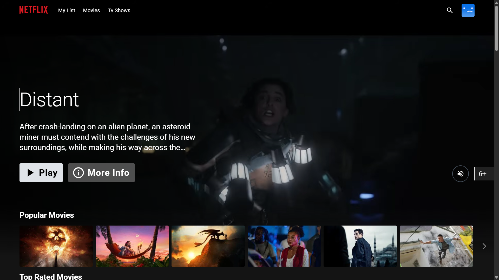
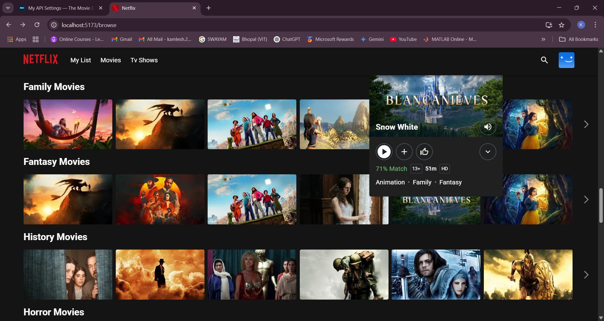

<div align="center">
  <a href="http://netflix-clone-with-tmdb-using-react-mui.vercel.app/">
    
  </a>

  <h1>Netflix Clone</h1>
  <p>React + MUI-based Netflix UI replica using TMDB API</p>
</div>

---

## 📑 Table of Contents

- [📑 Table of Contents](#-table-of-contents)
- [🖼️ Preview](#️-preview)
- [🔧 Prerequisites](#-prerequisites)
- [🚀 Features Covered](#-features-covered)
- [📦 Third-party Libraries](#-third-party-libraries)
- [🐳 Docker Setup](#-docker-setup)
- [📋 To-Do](#-to-do)

---

## 🖼️ Preview

<div align="center">
  
  <p><strong>Home Page</strong></p>

  
  <p><strong>Mini Portal</strong></p>

  
  <p><strong>Detail Modal</strong></p>

  
  <p><strong>Grid Genre Page</strong></p>

  
  <p><strong>Watch Page with Custom Control Bar</strong></p>
</div>

---

## 🔧 Prerequisites

- Create a free account on [TMDB](https://www.themoviedb.org/)
- Follow [TMDB Docs](https://developers.themoviedb.org/3/getting-started/introduction) to generate your **API key**
- If using the v3 TMDB API:
  - Copy `.env.example` as `.env`
  - Paste your API key in the `.env` file

---

## 🚀 Features Covered

- ✅ Custom Hooks  
- ✅ Context API with Provider  
- ✅ Code Splitting using `React.lazy` and `Suspense`  
- ✅ React Router `lazy` and `loader` features  
- ✅ Redux Toolkit (RTK) + RTK Query  
- ✅ Modals via React Portals  
- ✅ Forwarding Refs for reusable components  
- ✅ Higher Order Components (HOC)  
- ✅ MUI Theming and custom class name generation  
- ✅ Infinite Scrolling using Intersection Observer  
- ✅ Responsive Carousel with `react-slick`

---

## 📦 Third-party Libraries

> (Excluding React and Redux Toolkit)

- [`react-router-dom@v6.9`](https://reactrouter.com/en/main)
- [MUI](https://mui.com/)
- [Framer Motion](https://www.framer.com/docs/)
- [Video.js](https://videojs.com)
- [React Slick](https://react-slick.neostack.com)

---

## 🐳 Docker Setup

```bash
docker build --build-arg TMDB_V3_API_KEY=your_api_key_here -t netflix-clone .

docker run --name netflix-clone-website --rm -d -p 80:80 netflix-clone
```

## 📋 To-Do

- 🎞️ **Refine animation** of video card portal to better mimic Netflix.
- ⚙️ **Optimize context-related re-renders**  
  👉 Refer: [Prevent extra re-renders](https://blog.axlight.com/posts/4-options-to-prevent-extra-rerenders-with-react-context/)
- 🏗️ **Replace Vite with [Turbopack](https://turbo.build/pack/docs/why-turbopack)** (when stable)
- ♿ **Improve accessibility** for better UX.
- 🧪 **Add tests** to ensure component reliability and regression safety.
